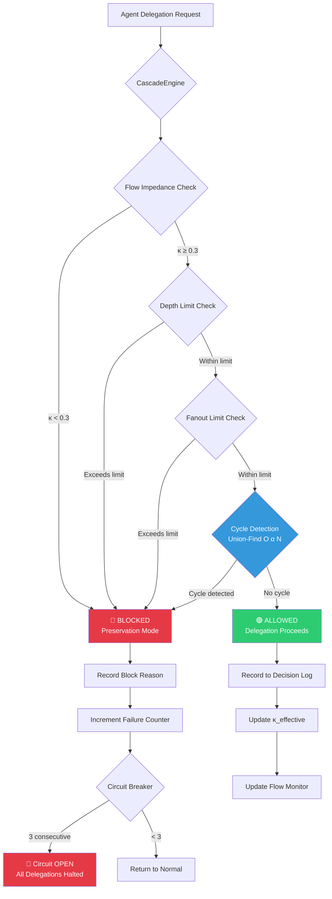
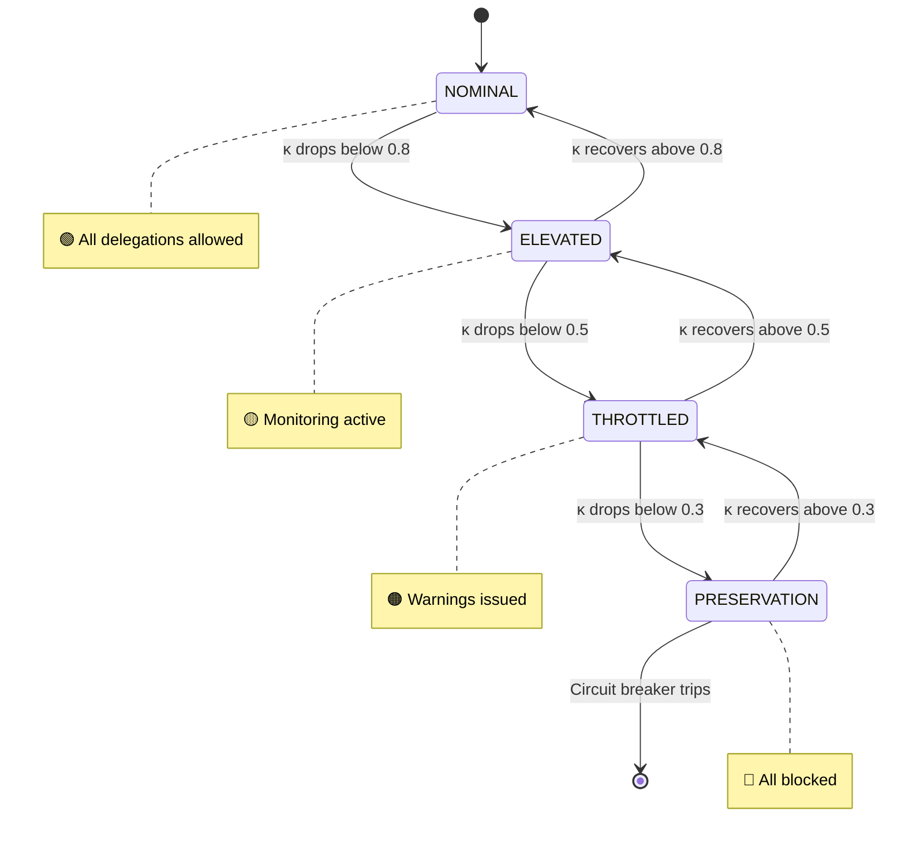

# CascadeGuard

**Real-Time Cascade Prevention for Multi-Agent Systems**

O(α(N)) cycle detection and distribution-based flow control. No LLM in the path. No latency penalty. No false negatives.

[](LICENSE)
[](https://python.org)

---

## The Problem

When autonomous AI agents delegate tasks to sub-agents at runtime, three failure modes emerge — all faster than any monitoring dashboard can detect:

| Failure Mode | What Happens | Time to Damage |
|---|---|---|
| **Circular delegation** | A→B→C→A loops forever | Milliseconds |
| **Exponential fanout** | One agent spawns 50, each spawns 50 more | Seconds |
| **Unbounded depth** | Chains grow past audit/accountability limits | Minutes |

Depth limits don't catch cycles (A→B→C→A is only depth 3). Timeouts are reactive — they detect failure after resources are consumed. LLM-based guardrails add 200-400ms per check, destroying the performance they're trying to protect.

---

## The Cost of Doing Nothing

| Failure Scenario | Detection Time (Traditional APM) | Damage Before Detection |
|---|---|---|
| Recursive LLM calls at $0.03/1K tokens | 5–10 minutes | **$1,200 – $5,000+** in API billing |
| Agent fanout explosion (50 spawns/sec) | 30–60 seconds | 1,500 – 3,000 phantom agents consuming compute |
| Circular delegation loop | Undetectable by depth limits | Infinite resource consumption until external kill |
| Cascading database writes | Minutes to hours | Corrupted state requiring manual reconciliation |

A single cascading event drains budgets before a middle-office analyst can open a monitoring dashboard.

### The Recursive Cascade Multiplier

In a runaway recursive loop, total context inflates exponentially. Assuming 4,000 input + 1,000 output tokens per iteration:

| Recursion Depth | Total Tokens | Cached ($0.005/1K) | Standard ($0.03/1K) | Frontier ($0.15/1K) |
|---|---|---|---|---|
| Iteration 1 | 5,000 | $0.025 | $0.15 | $0.75 |
| Iteration 5 | 25,000 | $0.125 | $0.75 | $3.75 |
| Iteration 20 | 100,000 | $0.50 | $3.00 | $15.00 |
| Iteration 100 | 500,000 | $2.50 | $15.00 | $75.00 |
| **Iteration 500 (Runaway)** | **2,500,000** | **$12.50** | **$75.00** | **$375.00** |

**Per agent.** With 5 concurrent agents in a parallel loop, multiply by 5. A $75 single-agent runaway becomes $375 per cluster run — before anyone notices.

**Where CascadeGuard trips the fuse:**

```
[Loop Start] → [Iteration 5: $0.75] → [Iteration 20: $3.00] → [💥 CascadeGuard Trips]
                                                                         │
                              [SAVED: Runaway escalation to $375+] ◄─────┘
```

Context window inflation and multi-agent concurrency make linear cost projections dangerously optimistic. CascadeGuard's microsecond circuit breaker stops the bleeding at iteration 20, not iteration 500.

---

## Computational Complexity

| Governance Approach | Complexity | Latency | Scaling Risk |
|---|---|---|---|
| Semantic LLM-in-the-Loop | O(N²) | 800ms – 2,400ms | Systemic Paralysis |
| Vector Embedding Closeness | O(K · N) | 150ms – 400ms | High Latency Drift |
| **CascadeGuard** | **O(α(N))** | **< 5ms** | **Zero** |

α(N) is the inverse Ackermann function. For any practical input (even billions of agents), α(N) ≤ 4. Effectively constant time.

**Benchmarked:** <250μs cycle detection on 1,000-agent chains. 32,000 delegation checks/second. 0% false positive rate on legitimate delegation chains.

---

## The Impedance Response Playbook

| Tier | κ_effective | System State | Automated Response |
|---|---|---|---|
| 🟢 **Green** | κ ≥ 0.7 | Laminar flow | Log telemetry silently. No intervention. |
| 🟡 **Yellow** | 0.3 ≤ κ < 0.7 | Turbulent flow | Enforce token-throttling. Alert operations. |
| 🔴 **Red** | κ < 0.3 | Structural loop imminent | **Circuit breaker trips.** Isolate branch. Preserve budget. |

κ_effective is computed from four distribution metrics:

```
Z = w_v · velocity_ratio + w_d · depth_ratio + w_f · fanout_ratio + w_c · concentration
κ_effective = 1.0 - Z
```

The fuse is self-healing. When metrics recover, κ rises and the system returns to Green automatically.

---

## Installation

```bash
pip install -e .
```

## Quick Start

```python
from cascade_guard import CascadeEngine
from cascade_guard.models import DelegationAction

engine = CascadeEngine(
    max_velocity=50.0,
    depth_limit=10,
    fanout_limit=20,
    preservation_threshold=0.3,
)

# Register root agent
engine.register_agent("orchestrator", model_id="gpt-4o")

# Spawn sub-agent (all safety checks run automatically)
result = engine.register_agent("planner", model_id="claude-3", parent_id="orchestrator")
assert result.allowed  # True — no cycle, within limits

# Attempt cycle (blocked instantly)
result = engine.attempt_delegation("planner", "orchestrator", DelegationAction.DELEGATE)
assert not result.allowed       # Blocked
assert result.cycle_detected    # Reason: circular dependency
```

## CLI Demo

```bash
cascade-guard-demo
```

Runs five scenarios: normal delegation chains, cycle detection, depth limits, fanout limits, and velocity-based impedance.

---

## Architecture



### Flow States



---

## Production Readiness

| Feature | Status |
|---|---|
| Cycle detection (Union-Find) | ✓ O(α(N)) with path compression |
| Distribution-based impedance | ✓ 4-metric weighted formula |
| Circuit breaker (3 consecutive failures) | ✓ CLOSED → OPEN → HALF_OPEN |
| Auto-recovery (heartbeat + state reconstruction) | ✓ Fail-cached mode |
| Decision log (append-only, survives crashes) | ✓ JSON capsules |
| Framework-agnostic | ✓ Works with any agent system |
| Zero external dependencies beyond pydantic | ✓ Minimal attack surface |

---

## The Full Defense Stack

CascadeGuard is Layer 1 of a four-layer defense:

| Layer | Tool | Function | Complexity |
|---|---|---|---|
| 1 | **CascadeGuard** | Cycle detection + flow control | O(α(N)) |
| 2 | **ACAP** | Topological authorization gaps | O(N²) worst |
| 3 | **VectorRBAC** | Latent-space access control | O(N log N) |
| 4 | **Supply Chain Guardrails** | Agent-solver boundary safety | O(1) per check |

CascadeGuard runs first, catches the most common failures (structural cycles, overload), and passes remaining cases to deeper analysis. Together: sub-millisecond cascade prevention with full topological authorization.

---

## Theory

See [THEORY.md](THEORY.md) for the design philosophy: why Union-Find over graph traversal, why continuous impedance over binary thresholds, why structural invariants over heuristic detection.

---

## Tests

```bash
pytest tests/ -v
```

37 tests covering Union-Find operations, engine behavior, flow monitor thresholds, circuit breaker state machine, and auto-recovery.

---

## Further Reading

- [Your Multi-Agent System Will Eat Itself in Constant Time](docs/Your-Multi-Agent-System-Will-Eat-Itself-In-Constant-Time.md) — Technical deep-dive article
- [THEORY.md](THEORY.md) — Design philosophy and mathematical foundations

---

## License

Apache-2.0

---

*Built by [Michael Brinkley](https://linkedin.com/in/michael-brinkley-mscis-a26b1a5) — 28 years across energy trading systems and AI infrastructure. 7 years ETRM platforms (Chevron, ConocoPhillips, Halliburton). 8 years AI solutions at AWS ($68M+ GenAI practice, 84 engineers). Building the structural safety layers that multi-agent systems need but don't ship with.*
