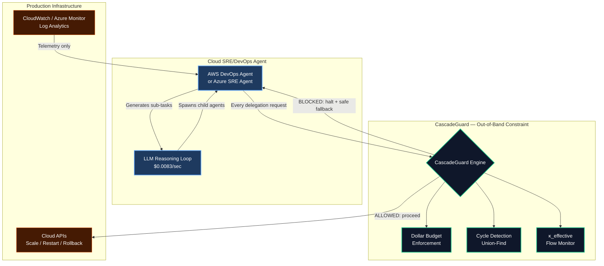

# Cloud Agent Integration Matrix

## The New Threat: Unbounded Agentic Budget Volatility

AWS DevOps Agent and Azure SRE Agent represent a new category of cloud-native autonomous operations. Both deploy LLM-backed logic loops with direct programmatic access to infrastructure changes (auto-scaling, rollbacks, resource allocation) and charge by the agent-second or token.

This architecture creates two enterprise vulnerabilities that CascadeGuard eliminates:

1. **Runaway Automation Cost Loop** — A rogue agent stuck in a diagnostic logic loop queries logs and tests configurations endlessly. At $0.0083/second (AWS) or variable AAU rates (Azure), an overnight loop generates catastrophic bills before a human intervenes.

2. **Telemetry Inflation** — Agents query vast log pools for correlation data, inflating data-egress and token-hydration costs between cloud providers and LLM endpoints.

CascadeGuard provides the **out-of-band Agentic Circuit Breaker** — a deterministic constraint layer that operates independently of the agent's LLM logic, enforcing firm financial and structural guardrails.

---

## Integration Matrix

| Constraint Layer | AWS DevOps Agent | Azure SRE Agent | CascadeGuard Enforcement |
|---|---|---|---|
| **Cost ceiling** | No built-in per-agent budget cap | AAU billing (no hard stop) | Global dollar budget + per-agent token limits. System halts at cap. |
| **Loop detection** | Relies on LLM self-awareness | Relies on LLM self-awareness | O(α(N)) Union-Find — catches loops in <250μs regardless of LLM state |
| **Delegation depth** | No structural limit | No structural limit | Configurable depth limit (default: 10). Blocks deeper chains. |
| **Agent fanout** | No spawn constraint | No spawn constraint | Configurable fanout limit (default: 20). Prevents explosive sub-agent spawning. |
| **Velocity control** | No rate limiting on agent actions | No rate limiting on agent actions | Continuous impedance monitoring — throttles automatically as velocity increases |
| **Recovery** | Platform-level restart | Platform-level restart | Self-healing: decision log replay, topology snapshots, automatic state reconstruction |
| **Compliance audit** | Non-deterministic LLM logs | Non-deterministic LLM logs | Deterministic, reproducible decision log. Maps to SOC 2, ISO 42001, NIST AI RMF. |
| **Attack surface** | Text-based (log injection risk) | Text-based (log injection risk) | Zero text surface — immune to prompt injection by design |

---

## Architecture: CascadeGuard as External Constraint Layer



---

## Deployment Pattern

CascadeGuard deploys as a sidecar or middleware intercept — it sits between the cloud agent's decision loop and the infrastructure APIs it calls:

```python
from cascade_guard import CascadeEngine
from cascade_guard.models import DelegationAction

# Configure for cloud agent workload
engine = CascadeEngine(
    max_velocity=100.0,           # Agent actions per second
    depth_limit=15,               # Max diagnostic chain depth
    fanout_limit=10,              # Max parallel investigations
    preservation_threshold=0.3,   # Trip fuse at this κ level
    dollar_budget=50.0,           # Max spend per investigation ($)
    cost_per_1k_tokens=0.03,      # LLM token pricing
)

def intercept_agent_action(source_agent: str, target_action: str, estimated_cost: float):
    """Middleware: intercept every cloud agent action before execution."""
    
    verdict = engine.attempt_delegation(
        source_agent, target_action, DelegationAction.DELEGATE,
        tokens_used=estimated_cost / 0.03 * 1000,  # Convert cost to tokens
    )
    
    if not verdict.allowed:
        # Agent is blocked — return safe fallback
        log_blocked_action(source_agent, target_action, verdict.reason)
        return {"status": "blocked", "reason": verdict.reason}
    
    # Safe to proceed
    return execute_cloud_action(target_action)
```

---

## Cost Projection: With vs. Without CascadeGuard

**Scenario:** Azure SRE Agent investigating a complex microservice failure. Agent enters a diagnostic loop, spawning 5 parallel investigation threads that each query logs every 2 seconds.

| Metric | Without CascadeGuard | With CascadeGuard |
|---|---|---|
| Loop duration before human notices | 8 hours (overnight) | 45 seconds (κ_effective trips) |
| Agent-seconds consumed | 144,000 | 225 |
| AWS cost ($0.0083/sec × 5 agents) | **$5,976** | **$9.34** |
| Azure cost (AAU equivalent) | **~$4,200** | **~$6.50** |
| Log queries generated | 72,000 | 112 |
| Data egress cost | **$800+** | **$1.25** |

**Total overnight damage prevented: $5,000–$7,000 per incident.**

---

## Why "Out-of-Band" Matters

Cloud agents use LLMs to reason about infrastructure. If you use another LLM to constrain them (the "guardrail LLM" pattern), you get:

- **Correlated failures:** When the infrastructure is stressed, both the agent LLM and the guardrail LLM experience the same latency spikes and rate limits.
- **Semantic bypass:** An agent reasoning about why it needs to spawn more sub-agents can convince a text-based guardrail that the spawning is justified.
- **Cost multiplication:** The guardrail LLM itself consumes tokens, adding to the very cost problem it's trying to solve.

CascadeGuard avoids all three because it doesn't use an LLM. It uses integer arithmetic on routing metadata. It cannot be convinced, confused, rate-limited, or cost-inflated. It either allows the delegation or it doesn't — in 250 microseconds, deterministically, every time.

---

## Summary

| | Cloud Agent Alone | Cloud Agent + CascadeGuard |
|---|---|---|
| Cost control | None (usage-based, unbounded) | Hard ceiling with graceful degradation |
| Loop protection | LLM must detect its own loops | Structural detection in constant time |
| Compliance | Non-deterministic audit trail | Deterministic, reproducible, framework-mapped |
| Recovery | Platform restart (minutes) | Self-healing (seconds) |
| Attack surface | Full text (log injection, prompt manipulation) | Zero text surface |

**CascadeGuard is the financial and structural safety net that cloud agent platforms don't provide.** It turns unbounded agentic compute into bounded, auditable, recoverable operations.
