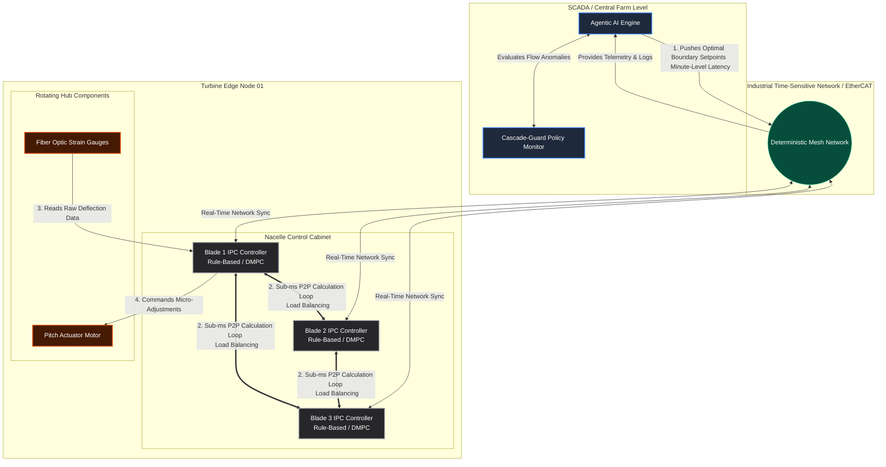

# CascadeGuard Use Cases

Real-world applications of O(α(N)) cycle detection and distribution-based flow control beyond multi-agent AI systems.

---

## 1. Wind Turbine Blade Coordination (P2P Industrial IoT)

**Problem:** In a peer-to-peer wind turbine setup, blade agents coordinate pitch adjustments with physical deadlines (100ms wind-pocket windows). If Blade A tells Blade B to adjust, and Blade B triggers Blade C, which accidentally loops back to Blade A, traditional monitoring adds 150–2,400ms latency — missing the physical deadline and causing structural failure.

**How CascadeGuard Helps:** Union-Find cycle detection executes in <250μs, well within the 100ms physical deadline. The circuit breaker trips before recursive software loops consume the real-time computing power required to pitch physical blades.

**κ_effective Mapping:**
| Flow State | Software Behavior | Physical Equivalent |
|---|---|---|
| 🟢 Green (κ ≥ 0.7) | Agents coordinating smoothly | Laminar airflow, normal pitch |
| 🟡 Yellow (0.3 ≤ κ < 0.7) | Frantic communication, high load | Turbulent wind, rate-limited adjustments |
| 🔴 Red (κ < 0.3) | Loop or chaotic cascade imminent | Circuit breaker trips, emergency feathering |

**Implementation:**
```python
from cascade_guard import CascadeEngine
from cascade_guard.models import DelegationAction

engine = CascadeEngine(
    max_velocity=100.0,        # Micro-adjustments per second
    depth_limit=3,             # Max blades in coordination chain
    fanout_limit=5,            # Max downstream neighbors per agent
    preservation_threshold=0.3,
)

engine.register_agent("blade_1", model_id="embedded_pitch_v1")
engine.register_agent("blade_2", model_id="embedded_pitch_v1", parent_id="blade_1")

# Circular loop attempt — blocked in <250μs
result = engine.attempt_delegation("blade_2", "blade_1", DelegationAction.DELEGATE)
if not result.allowed:
    execute_emergency_feathering()
```

**Key Insight:** The software's information flow dynamics (laminar/turbulent/chaotic) mirror the physical aerodynamics. CascadeGuard's flow states aren't a metaphor — they're a structural isomorphism.

**Architecture Diagram:**



---

## 2. Multi-Agent AI Systems (Token Budget Protection)

**Problem:** Autonomous AI agents delegate tasks to sub-agents at runtime. Circular delegations, exponential fanout, and unbounded depth drain API budgets in milliseconds — faster than any monitoring dashboard can detect.

**How CascadeGuard Helps:** Detects cycles in constant time, enforces per-agent and global token budgets, and trips the circuit breaker before runaway costs accumulate.

**Cost Impact:**
| Scenario | Without CascadeGuard (500 iterations) | With CascadeGuard (trips at 20) |
|---|---|---|
| 5 agents, $0.03/1K tokens | $375.00 | $15.00 |

---

## 3. Drone Swarm Coordination

**Problem:** Autonomous drones in a swarm relay commands peer-to-peer. A routing loop means drones continuously re-broadcasting the same instruction, consuming bandwidth and battery while failing to execute the actual mission.

**How CascadeGuard Helps:** Each relay is a delegation. Cycle detection prevents routing loops. Fanout limits prevent broadcast storms. κ_effective monitors communication health in real-time.

---

## 4. Microservice Orchestration

**Problem:** Service A calls Service B, which calls Service C, which calls Service A. Traditional circuit breakers (Hystrix, resilience4j) detect failures after they happen. They don't prevent circular call chains proactively.

**How CascadeGuard Helps:** Registers services as agents and delegation attempts as calls. Cycles are detected before the call is made — preventing the cascade rather than recovering from it.

---

## 5. Supply Chain Agent Networks

**Problem:** Procurement agents negotiate with supplier agents, who sub-delegate to logistics agents. Circular dependencies (Agent A depends on Agent B's output, which depends on Agent A's approval) create deadlocks that are invisible until timeout.

**How CascadeGuard Helps:** Models the dependency graph in real-time. Detects circular dependencies at registration time, before any work begins.

---

## 6. Autonomous Vehicle Fleet Coordination

**Problem:** Vehicle-to-vehicle (V2V) communication where cars coordinate lane changes and intersection negotiations. A coordination loop (Car A yields to Car B, Car B yields to Car C, Car C yields to Car A) creates a deadlock at an intersection.

**How CascadeGuard Helps:** Sub-millisecond detection of coordination cycles. Depth limits prevent chain-reaction yielding. The circuit breaker forces a deterministic resolution (e.g., priority by timestamp) when the flow state degrades.

---

## Contributing Use Cases

Found a new application for CascadeGuard? Open an issue or PR with your use case. We're particularly interested in:
- Real-time physical systems with hard latency deadlines
- P2P autonomous coordination networks
- Financial trading systems with circular dependency risks
- Healthcare workflow automation with patient safety constraints
